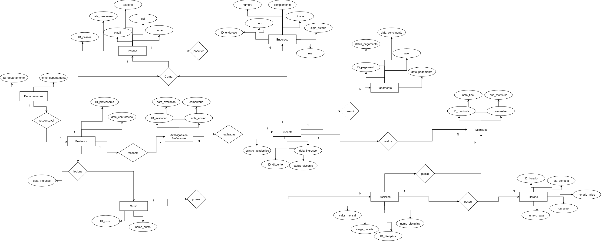

# Trabalho de Banco de Dados

## Sumário

## Sobre o projeto

Projeto de criação de um banco de dados da disciplina Banco de Dados [DCE534] (A) (08) - 2024/2, ministrada pela professora Mariane Moreira de Souza.

### Membros do grupo

- Vinicius Boiago - 2023.1.08.024
- Rodrigo Rolucatelli - 2023.1.08.019
- Leonardo Bonardi - 2023.1.08.011
- Jose Olavo - 2023.1.08.009

## Banco de dados

### Modelo Entidade Relacionamento



## Como rodar a aplicação

### Conexão com o banco de dados
1. Rodar o docker compose presente na pasta local:
```
docker compose up -d
```
2. Estabelecer conexão com uma ferramenta de administração de BDs.
```
Host: localhost
Porta: 5432
Banco de dados: escola
Usuário: unifalmg
Senha: unifalmg123
```


### Pré-requisitos

- [Docker](https://docs.docker.com/desktop/setup/install/windows-install/)
- [DBeaver](https://dbeaver.io/) (recomendação)
